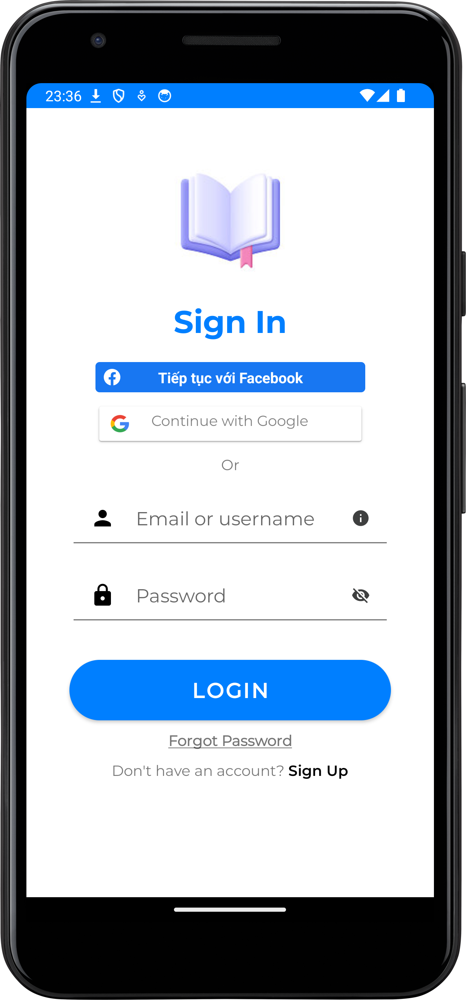
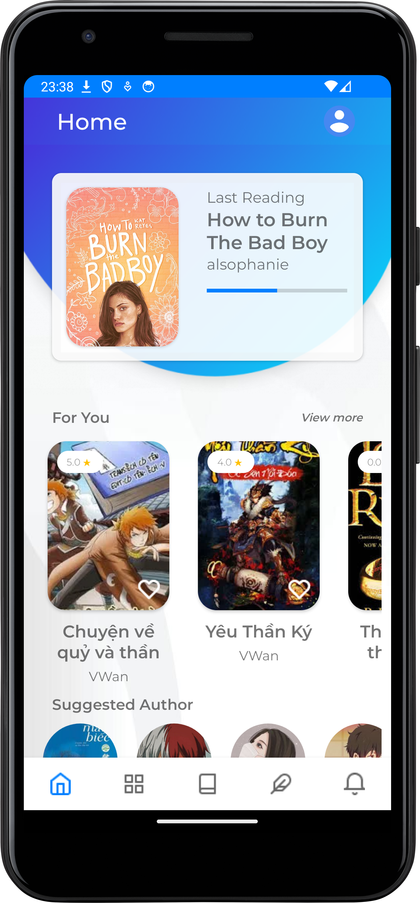
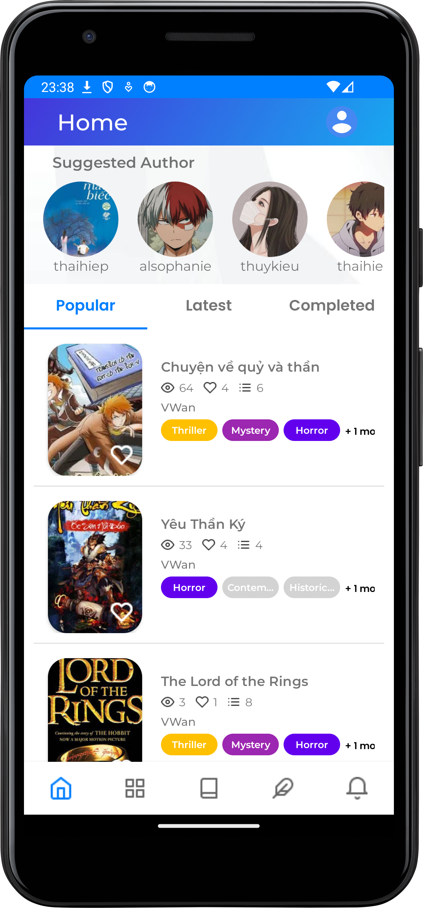
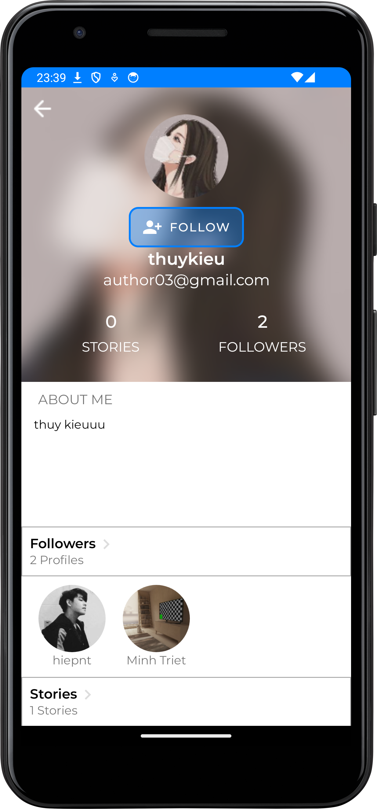
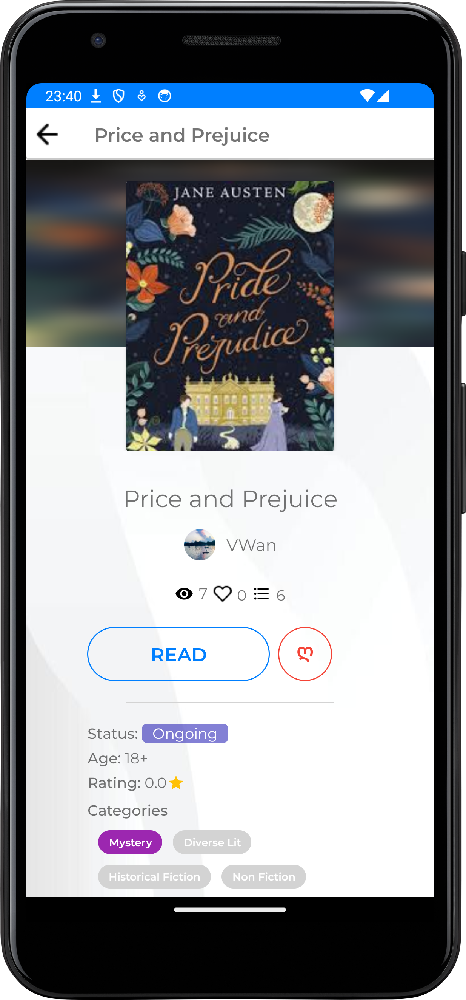
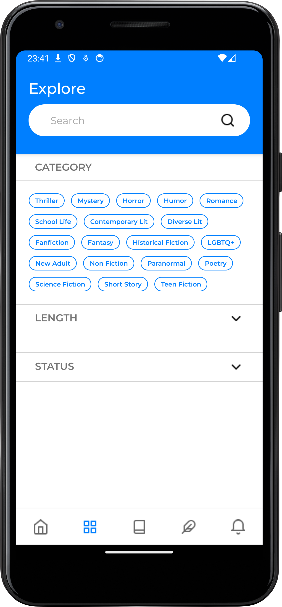
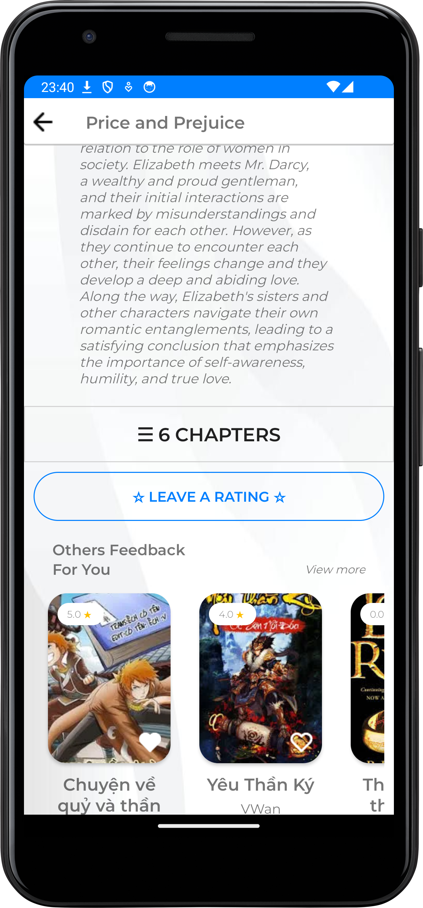
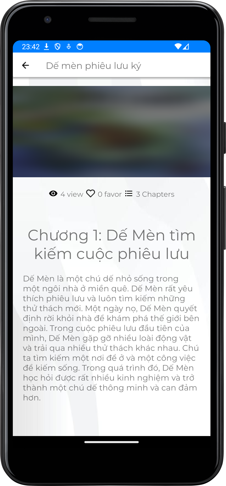
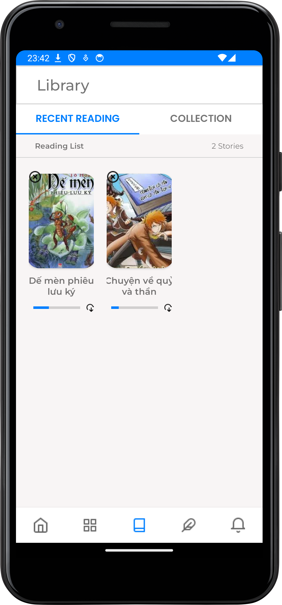
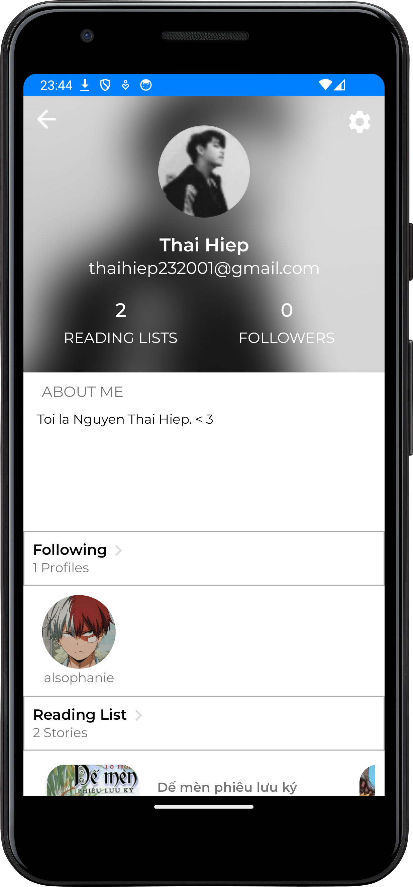

# MyShop Desktop Application

- Made with Kotlin language
- Made with MongoDB
- The Project of **Android Programming** Subject (Trần Duy Quang, M.Sc Instructor)
- Scores: 9.4/10
- Members of the Group:

    1. Nguyễn Thái Hiệp
    2. Đặng Bảo Châu
    3. Quân Lê
    4. Nguyễn Đình Văn

# Requirements

- Install [Android Studio](https://developer.android.com/)

# Development

```
- Clone this repository
- Open it with Android Studio
```

# Deployment

```
- Start this project throught Android Studio
```

# Overview

- Video Demo: https://www.youtube.com/watch?v=kDsBFFCIygw&t=20s













Thanks for watching.
